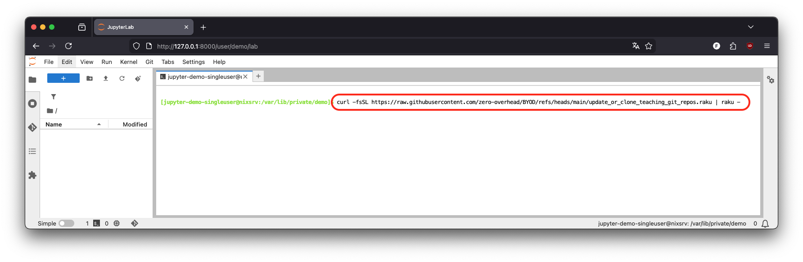
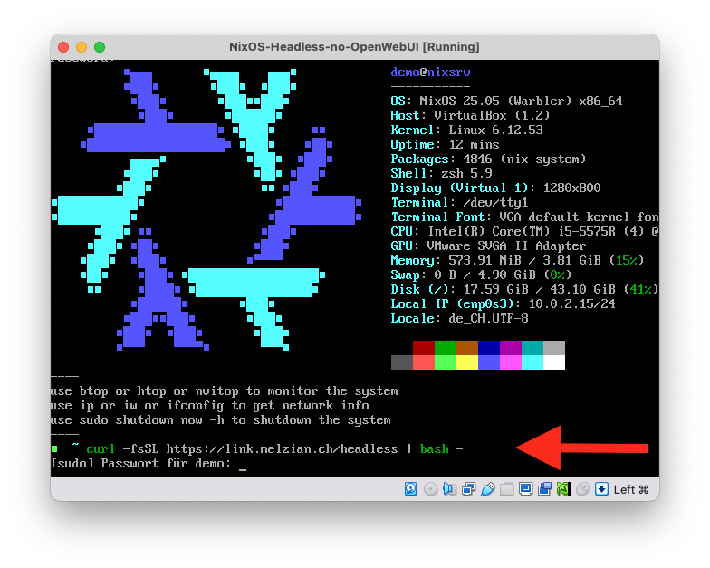

# Jupyter in der JuypterHub-VM

Jupyter läuft in der VM und du greifst via Browser von deinem Computer darauf zu.

Starte die JupyterHub-VM `NixOS-Headless` und gib anschliessend in deinem Browser folgende URL ein:

```bash
http://127.0.0.1:8000
```

Du kannst dich nun mit einem beliebigen Nutzernamen anmelden. Das Passwort lautet aber immer `go`.

Um die Notebooks zu aktualisieren, starte in Jupyter ein Terminal und führe den folgenden Befehl aus:

```bash
curl -fsSL https://link.melzian.ch/notebooks | raku -
```



## Headless-VM aktualisieren oder reparieren

Du aktualisierst die Headless-VM mit u.g. Befehl. Tippe diesen in das VirtualBox-Fenster ein, dass nach dem Starten der VM erscheint. Das Passwort für den Nutzer `demo` lautet `demo` und wird bei der Eingabe nicht angezeigt.

Auch wenn mal irgendetwas kaputt gegangen ist und du keinen Snapshot in VirtualBox/UTM wiederherstellen kannst - weil du bspw. keinen angelegt hast, als die VM noch funktioniert hat -  kannst du mit dem gleichen Befehl die Headless-VM reparieren.

```bash
curl -fsSL https://link.melzian.ch/headless | bash -
```


