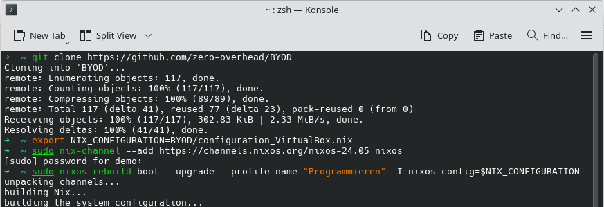

# BYOD + VirtualBox/UTM + NixOS = Unified Programming Environment

## Aktualisierung
Falls du schon eine NixOS-VM besitzt, und diese nun aktualisieren möchtest, führe folgende Befehle in einem Terminal innerhalb der NixOS-VM, die du aktualisieren 
möchtest, aus.

```bash
git clone https://github.com/zero-overhead/BYOD
```

ACHTUNG: Das Passwort des Nutzers demo lautet "demo". Bei der Eingabe des Passwords im Terminal wird aus Sicherheitsgründen nichts angezeigt.

Nur für VirtualBox:
```bash
export NIX_CONFIGURATION=BYOD/configuration_VirtualBox.nix
```

Nur für UTM:
```bash
export NIX_CONFIGURATION=BYOD/configuration_UTM.nix
```

Für alle:

ACHTUNG: Das Passwort des Nutzers demo lautet "demo". Bei der Eingabe des Passwords im Terminal wird aus Sicherheitsgründen nichts angezeigt.

```bash
sudo nix-channel --add https://channels.nixos.org/nixos-24.05 nixos
```

```bash
sudo nixos-rebuild boot --upgrade --profile-name "Programmieren" -I nixos-config=$NIX_CONFIGURATION
```

```bash
reboot
```

Den Ordner ```BYOD``` benötigst du nicht mehr und kannst ihn löschen.

Falls wieder Erwarten die neue Konfiguration nicht korrekt startet oder andere Problem macht, wähle beim Starten der VM im Boot-Menü den vorletzten Eintrag aus. Führe dann diesen Befehl aus, um die Änderungen rückgängig zu machen:

```bash
sudo nixos-rebuild switch --rollback
```



## Erstinstallation

### Vorbereitung

Windows: öffne den Datei-Explorer, klicke im Menü auf "Datei -> Ordner und Suchoptionen ändern -> Ansicht" und entferne den Haken bei "Erweiterung bei bekannten Dateitypen ausblenden". Klicke dann "Für Ordner übernehmen" 

Mac: öffne den Finder, klicke dann im Menü "Einstellungen -> Erweitert" und aktiviere den Haken bei "Alle Dateinamensuffixe einblenden"

### Windows/Mac mit Intel- oder AMD-CPU

- Installiere VirtualBox. Du findest den Download unter https://www.virtualbox.org/
- Kopiere die Datei ```Programmieren.ova``` im Ordner ```SuS-Setup``` vom USB-Stick auf deinen Computer nach bspw. ```Downloads```.
- Öffne die Datei ```Programmieren.ova``` aus dem Ordner ```Downloads``` in VirtualBox.
- Starte die VM
- Nutzer/Passwort: demo/demo
- Mit der rechten CTRL+F wechselst du ins Vollbild und wieder zurück. Alternativ ziehe die Maus an den unteren Bildschirmrand, dort siehst du einen Knopf ```_``` bzw. ```x``` zum verlassen der VM. Oder ziehe mit drei Fingern auf deinem Touchpad aufwärts oder abwärts.

### Mac mit Apple-CPU (M1/M2/M3)

- Installieren von UTM. Du findest den Download unter https://mac.getutm.app/
- Kopiere die Datei ```Programmieren.utm``` im Ordner ```SuS-Setup-Mac``` vom USB-Stick auf deinen Computer nach bspw. ```Downloads```.
- Lösche die Datei ```Programmieren.utm``` bis zum Ende des Schuljahres nicht aus dem Download-Ordner. 
- Öffne die Datei ```Programmieren.utm``` im Ordner ```Downloads``` in UTM unter "Neue Virtuelle Maschine erstellen -> öffnen" und folge den Anweisungen.
- Starte die VM
- Nutzer/Passwort: demo/demo

### Windows ARM-CPU (Snapdragon)
siehe "Bei mir funktioniert das nicht ..." am Ende dieses Dokuments

### Bei mir funktioniert das nicht ...

Falls das Setup auf deinem Computer nicht gelingt:

- installiere die Anwendungen direkt
    - https://tigerjython.ch/de/products/download
    - https://thonny.org/
    - https://www.lernsoftware-filius.de/

**oder**

- nutze fürs Programmieren einen (älteren) Laptop, den du bei Freunden oder Familie für das Schuljahr ausleihst. Aktuell werden viele (an sich tadellose) Laptops ausgemustert, da sie die Hardwareanforderungen für Windows 11 nicht erfüllen. 

**oder**

- verwende für die Programmierübungen die Online-Lösungen
    - https://webtigerjython.ethz.ch/ oder
    - https://webtigerpython.ethz.ch/ oder
    - https://sagecell.sagemath.org/ bzw. https://cocalc.com/
    - ...

Die Jupyter-Notebooks kannst du in dem Fall auf [Github](https://github.com/zero-overhead/sek2.inf) anschauen und bspw. mit [Binder](https://mybinder.org/v2/gh/rcmlz/edu-binder-env/python?urlpath=git-pull%3Frepo%3Dhttps%253A%252F%252Fgithub.com%252Fzero-overhead%252Fsek2.inf%26urlpath%3Dlab%252Ftree%252Fsek2.inf) oder [Colab](https://colab.research.google.com/) die Übungen bearbeiten.

**Aber**: Support durch deine Informatik-Lehrperson wird nur für das Standard-Programmier-Setup via VM geleistet.

### Aufräumen

Nach Abschluss des Schuljahres versetzt du deinen Computer wieder in den Ausgangszustand, indem du die VMs in VirtualBox bzw. UTM und danach die Programme VirtualBox bzw. UTM selbst löschst.
