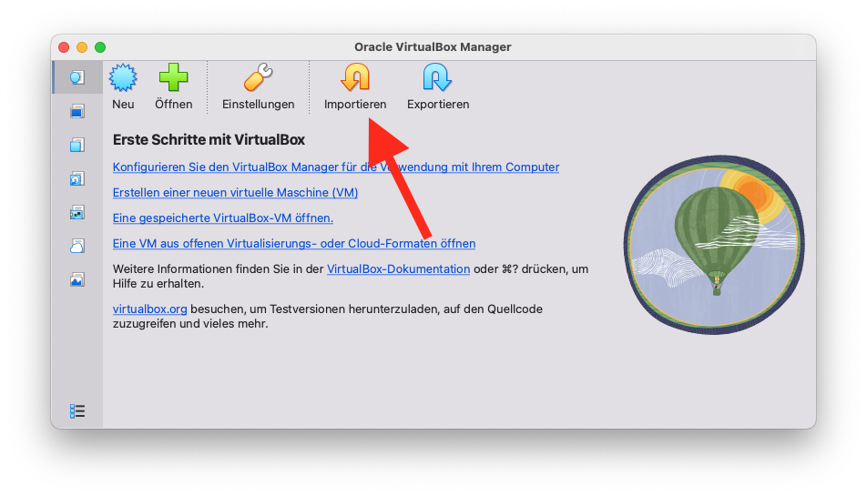
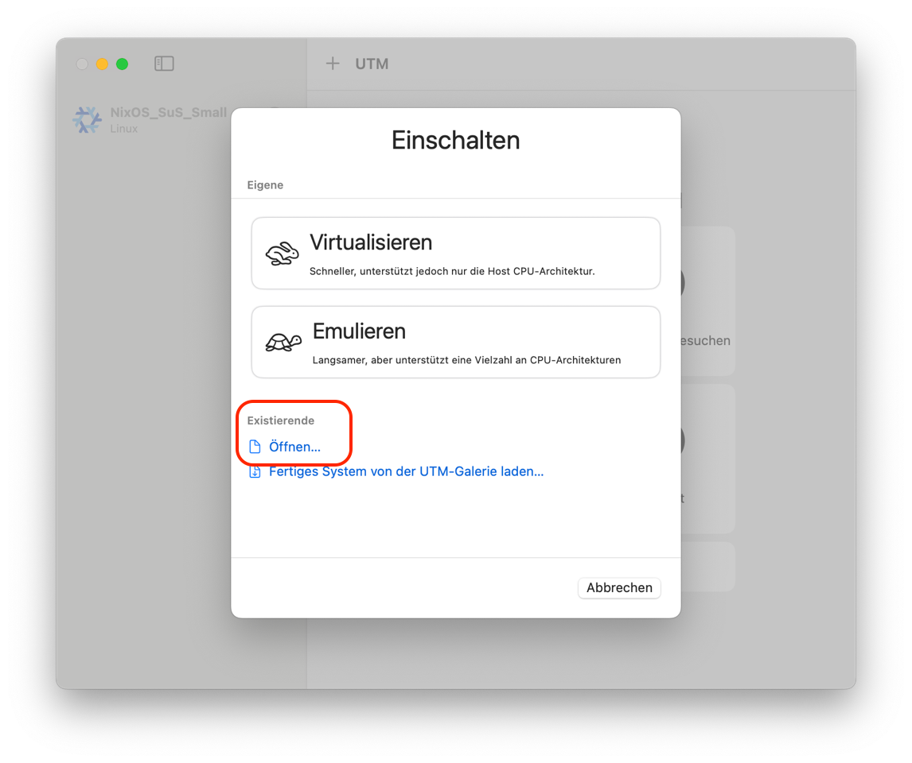

# BYOD + [VirtualBox](https://www.virtualbox.org) oder [UTM]( https://mac.getutm.app) + [NixOS](https://nixos.org) = Unified CS-Teaching Environment

1. Wenn du von deinem Computer per Browser auf ein vorkonfiguriertes Jupyter in der Headless-Variante der VM zugreifen willst: [Headless.md](Headless.md)
2. Das Passwort des Nutzers `demo` in der Basis-NixOS-VM lautet `demo`. Bei der Eingabe des Passwords im Terminal wird aus Sicherheitsgründen nichts angezeigt.

## Installation und Aktualisierung

Erzeuge eine neue oder - etwas einfacher für Einsteiger - importiere eine fertige NixOS-VM.

|Virtual Box|UTM|
|--|--|
|  | |

Starte deine VM und öffne ein Terminal.

Falls du ein ganz frisch installiertes NixOS als Ausgangspunkt verwendest, gib zuerst diesen Befehl ein

```bash
nix-shell -p git
```

und dann entweder

### für Virtual-Box auf Intel/AMD CPUs:

```bash
curl -H 'Pragma: no-cache' -fsSL https://raw.githubusercontent.com/zero-overhead/BYOD/refs/heads/main/setup.sh | bash -s VirtualBox.nix
```

oder

### für Virtualisierung via UTM auf MacOS:
```bash
curl -H 'Pragma: no-cache' -fsSL https://raw.githubusercontent.com/zero-overhead/BYOD/refs/heads/main/setup.sh | bash -s UTM.nix
```

Lass die Installation bis zum Ende durchlaufen. Dies dauert etwa 10 Minuten - je nachdem wie schnell dein Rechner und deine Internetverbindung sind.

### Neustart

Nach Abschluss der Installation bitte im Terminal den Befehl `reboot` eingeben. Die VM startet jetzt neu.

```bash
reboot
```

Falls wieder Erwarten die neue Konfiguration nicht korrekt startet oder andere Probleme bereitet, wähle beim Starten der VM im Boot-Menü den vorletzten Eintrag aus. Führe dann diesen Befehl aus, um die Änderungen rückgängig zu machen:

```bash
sudo nixos-rebuild switch --rollback
```

### virtuelle Festplatte voll?

Falls die virtuelle Festplatte einmal voll ist, kann mit ff. Befehl aufgeräumt werden:

```bash
sudo nix-collect-garbage -d
```

oder auch 

```bash
cleanup-nix
```

## Aufräumen

Wenn du keinen Informatikunterricht mehr hast, kannst du deinen Computer wieder aufräumen:

- Lösche zuerst die virtuellen Maschinen (VMs) in VirtualBox oder UTM.
- Danach kannst du auch die Programme VirtualBox oder UTM selbst löschen.

Du kannst die VMs aber auch exportieren und auf einen anderen Computer übertragen – praktisch, wenn du später den Rechner wechselst und deine VMs behalten möchtest.


### für physische Installationen auf Intel/AMD CPUs:

Falls du anstelle einer VM einen (ausgemusterten Windows-10) Rechner verwendest, installiere auf diesem direkt [NixOS](https://nixos.org) und führe dann

```bash
nix-shell -p git
```

und danach

```bash
curl -H 'Pragma: no-cache' -fsSL https://raw.githubusercontent.com/zero-overhead/BYOD/refs/heads/main/setup.sh | bash -s x86_64-Desktop.nix
```
aus.
