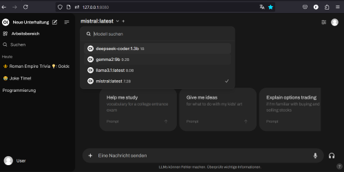
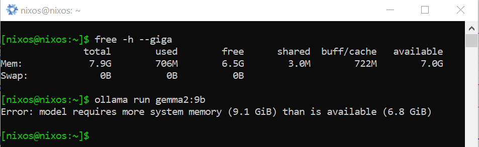
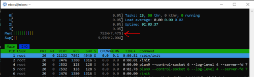
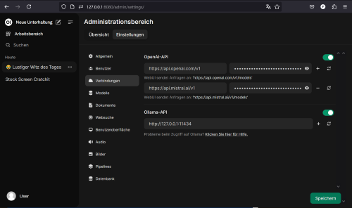

# BYOD-Windows-Rechner + NixOS@WSL
BYOD $\to$ heterogene Umgebung + WSL + NixOS $\to$ indentische Umgebung fürs Programmieren im Klassenraum.

## Setup

1. Starte eine Windows-Kommandozeile (CommandPrompt oder PowerShell)

2. Aktiviere WSL (Windows Subsystem für Linux)
```bash
wsl --install --no-distribution
```

3. Lade die Datei NixOS-WSL-Launcher.zip von https://github.com/nix-community/NixOS-WSL (the latest release -> Assets) und entpacke diese, bspw. im Ordner "C:\Program Files\NixOS-WSL-Launcher". Führe dann ff. Befehle aus
```bash
cd "C:\Program Files\NixOS-WSL-Launcher"
.\NixOS.exe install
```

4. Mache NixOS zur Default-Distribution
```bash
wsl -s NixOS
```

Hat es funktioniert?

```
wsl --list
```

5. Schliesse nun die Windows-Kommandozeile.

6. Starte die NixOS.app

Windows Start Menu -> tippe "wsl"

Pinne diese Anwendung an die Taskleiste. (rechte Maustaste)

8. Hole dir die aktuelle Konfiguration
```bash
nix-shell -p git
```

```bash
git clone --single-branch --branch wsl https://github.com/zero-overhead/BYOD
```

8. Kopiere die Konfiguration an die richtige Stelle
```bash
sudo cp -r BYOD/con* /etc/nixos/
```

Falls du eine Nvidia- oder AMD-Grafikkarte besitzt, editiere die entsprechende Zeile ```services.ollama.acceleration``` in der Datei ```configuration.nix```.

```sudo nano /etc/nixos/configuration.nix```

9. Aktiviere die Konfiguration
```bash
sudo nix-channel --update
```

```bash
sudo nixos-rebuild switch
```

10. Test

Installiere zunächst mindestens ein einfaches, kleines Modell.

```bash
ollama pull qwen2:0.5b
```

oder

```bash
ollama pull deepseek-coder:1.3b
```

Eine Übersicht der verfügbaren Modelle findest du unter https://ollama.com/models

Teste dann Folgendes:

- ollama: ```ollama list``` und dann bspw. ```ollama run deepseek-coder:1.3b```, mit ```/bye``` verlässt du den Chat.
- open-webui: copy/paste ```http://127.0.0.1:8080/``` in deinen Browser (bzw. ```10.0.2.2:8080``` aus einer Virtual-Box-VM)



Weitere Modelle kannst du auch mittels Open-WebUI über ```User -> Einstellungen -> Administrationsbereich -> Modelle``` hinzufügen. 

- oterm: teste das Programm ```oterm``` - für den Fall, dass du ein abgespecktes Interface zu Ollama bevorzugst.

Hinweis: Ein Modell sollte sigifikannt kleiner sein, als der verfügbare Arbeitsspeicher.



Verwende ```free -h --giga``` oder bspw. ```htop``` um diesen Wert für dich zu bestimmen.



Falls du einen API-Key für bspw. OpenAI oder Mistral besitzt, füge diesen unter dem Punkt ```Verbindungen``` hinzu. Für Mistral lautet die URL bspw. https://api.mistral.ai/v1, für OpenAI hingegen https://api.openai.com/v1



Die Auslastung deines Windows-Host zeigt dir das Windows-Programm "Task Manager".
